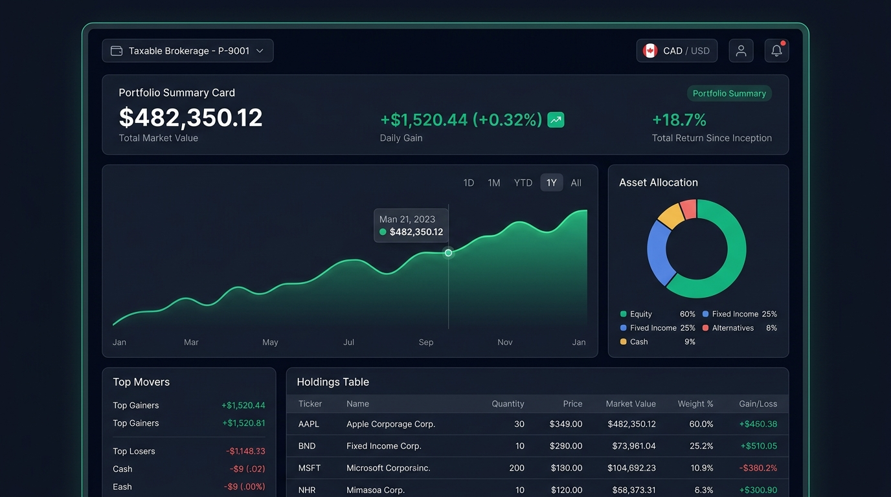

# Wealth Management Dashboard: UI/UX Design Specification

This directory contains the visual design mockup and design system reference for the **Wealth Management Portfolio Dashboard**.

---

## 1. Aesthetic & Theme Overview

* **Theme**: Deep Obsidian Dark Mode (`#0B0F19` background with `#151E2E` card surfaces).
* **Accents**: 
  * Positive Gains / Upward Trends: `#10B981` (Emerald Green)
  * Negative Losses / Downward Trends: `#EF4444` (Vibrant Coral/Red)
  * Neutral / Subdued Labels: `#94A3B8` (Slate Muted)
  * Highlights & Primary Focus: `#38BDF8` (Sky Blue) & `#10B981` (Emerald)
* **Visual Effects**: Subtle border glow (`rgba(255, 255, 255, 0.08)`), 12px border radii, glassmorphism headers, and smooth micro-transitions on hover.

---

## 2. Layout Breakdown & Requirements Mapping

### Top Navigation & Controls
* **Account Selector (Requirement 8)**: Dropdown on the top-left allowing instant switching between accounts (e.g., `Taxable Brokerage - P-9001` vs. `Traditional IRA - P-9002`).
* **Currency Toggle (Requirement 7)**: Global switch on the top-right toggling `CAD ↔ USD` without page reload.

### Hero Section: Portfolio Summary Card (Requirement 2)
* **Total Market Value**: Large prominent typography (`$482,350.12`).
* **Day Change**: Distinct pill badge showing dollar amount and percentage (`+$1,520.44 (+0.32%)`) with direction indicator.
* **Return Since Inception**: Percentage badge (`+18.7%`).

### Middle Section: Visual Analytics
* **Performance Line Chart (Requirements 4 & 6)**:
  * Glowing gradient area under the curve.
  * Interactive tooltip displaying exact date and value on hover.
  * Date range selector pills (`1D`, `1M`, `YTD`, `1Y`, `All`) with active state.
* **Asset Allocation Donut Chart (Requirement 5)**:
  * Color-coded segments for Equity, Fixed Income, Cash, Alternatives.
  * Compact legend showing asset classes and percentage weights.

### Bottom Section: Operational Views
* **Top Movers Widget (Requirement 10)**:
  * Summarizes top gainers and top losers of the day side-by-side with color-coded returns.
* **Holdings Table (Requirement 3 & 9)**:
  * Tabular layout with columns: `Ticker`, `Name`, `Quantity`, `Price`, `Market Value`, `Weight %`, and `Gain/Loss`.
  * Column headers clickable for ascending/descending sorting.
  * Clicking any row opens the **Detailed Holding View** modal/drawer (Requirement 9) showing purchase date, cost basis, 52-week high/low, dividend yield, and ticker price history.
